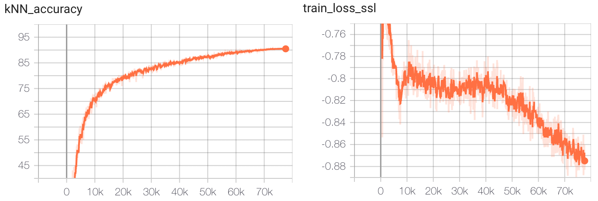

A minimal PyTorch example of training [SimSiam](https://arxiv.org/abs/2011.10566)
on CIFAR10 with a kNN predictor to report the accuracy after each epoch. 
The code uses [lightlys](https://github.com/lightly-ai/lightly) version of SimSiam.

Final test set accuracy is 91% which is similar to the original paper.

# Installation

```
pip install requirements.txt
```

## Dependencies

This code uses SimSiam provided by [lightly](https://github.com/lightly-ai/lightly). We use [PyTorch Lightning](https://github.com/PyTorchLightning/pytorch-lightning) for the 
training loop. There is [another example of using SimSiam with lighlty and plain
PyTorch here](https://docs.lightly.ai/tutorials/package/tutorial_simsiam_esa.html).

# Train SimSiam on CIFAR10

Training on a V100 GPU takes around 8 hours for 800 epochs and reaches around
91% accuracy on the test set.

You can run training using the following command:

```
python main.py
```

The `main.py` script is kept very simple. You can modify common parameters such
as number of epochs, batch size, number of workers etc.

The default values are:

- num_workers = 8
- max_epochs = 800
- knn_k = 200
- knn_t = 0.1
- classes = 10
- batch_size = 512
- seed=1

Here are the tensorboard plots:


You can access the tensorboard logs using
```
tensorboard --logdir lightning_logs/
```